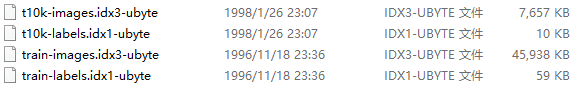
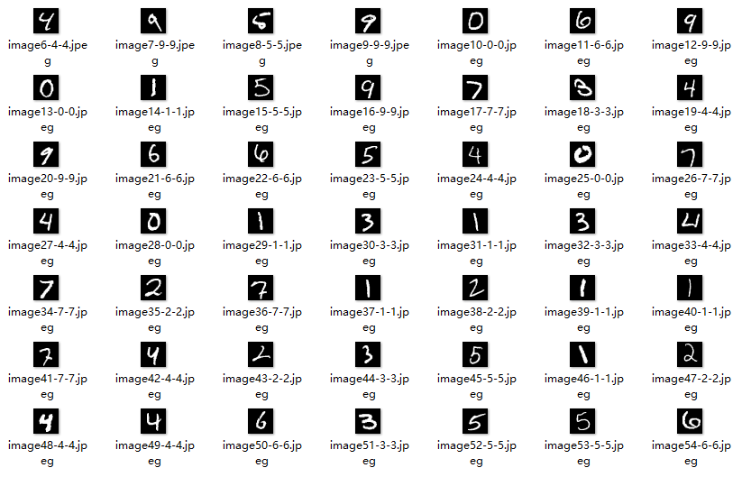
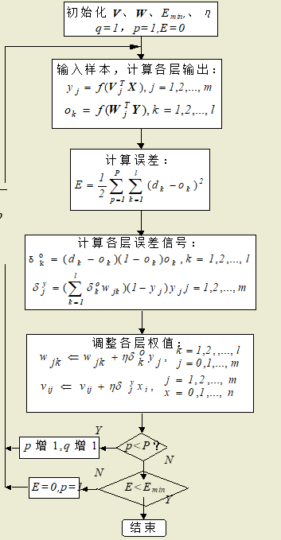
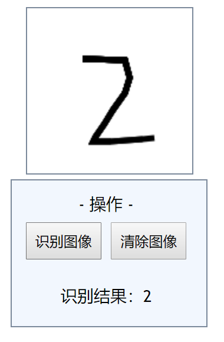
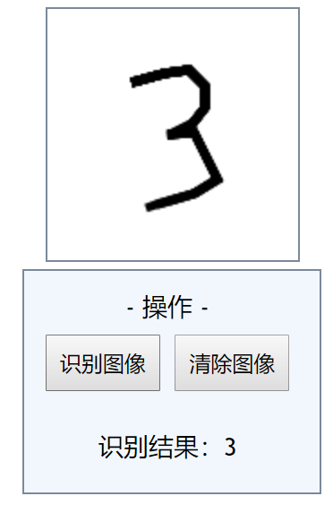

# BP Neural Network

BP 神经网络识别手写数字

## 数据集

http://yann.lecun.com/exdb/mnist/

来源于网上一份60000个数字图片的训练集以及10000个图片的测试集


## 解析数据集



这一份数据集并不是我们常见的格式，而是根据他定义的特定的格式以大端模式存储的二进制文件

因此我们需要先解析

### 标签数据集

```
TRAINING SET LABEL FILE (train-labels-idx1-ubyte):
[offset] [type]          [value]          [description] 
0000     32 bit integer  0x00000801(2049) magic number (MSB first) 
0004     32 bit integer  60000            number of items 
0008     unsigned byte   ??               label 
0009     unsigned byte   ??               label 
........ 
xxxx     unsigned byte   ??               label
The labels values are 0 to 9.
```

首先第一个byte是一个Magic number，第二个byte是这个集合里面的数据项个数

然后接下来的byte就是对应的图片所对应的正确数字


### 图片数据集

```
TRAINING SET IMAGE FILE (train-images-idx3-ubyte):
[offset] [type]          [value]          [description] 
0000     32 bit integer  0x00000803(2051) magic number 
0004     32 bit integer  60000            number of images 
0008     32 bit integer  28               number of rows 
0012     32 bit integer  28               number of columns 
0016     unsigned byte   ??               pixel 
0017     unsigned byte   ??               pixel 
........ 
xxxx     unsigned byte   ??               pixel
Pixels are organized row-wise. Pixel values are 0 to 255. 0 means background (white), 255 means foreground (black).
```

和标签数据集一样，第一个byte是一个Magic number，第二个byte是这个集合里面的数据项个数

第三个和第四个则是一张图片的宽度和高度

接下来就是以一位数组存储的图片信息，每个图片占据（28*28）个byte


通过解析这些数据，我们可以得出图片和对应的标签



顺便一提，有些写得是真的难以识别


## BP神经网络

BP神经网络是一种按误差反向传播(简称误差反传)训练的多层前馈网络，其算法称为BP算法，它的基本思想是梯度下降法，利用梯度搜索技术，以期使网络的实际输出值和期望输出值的误差均方差为最小。

### 基本结构

这里采用了三层结构的全连接的BP神经网络


#### 输入层

首先输出层有`28*28`个节点，分别对应图片的`28*28`的像素

如果当前像素为背景像素，那么就为`0`，如果是数字所在的像素，那么就为`1`


#### 隐含层

隐含层的节点数是自定义的，一般情况下，节点数越多，每次训练中误差的收敛的速度就快，但是同时每一次训练所花费的时间也会线性增长。

在本机的测试中

在`64`个节点的时候，`5`次训练之后其均方差达到了`0.0101`的水平，而对于测试集的识别率达到了`92.51%(+-0.1%)`

在`144`个节点的时候，`3`次训练之后其均方差达到了`0.0081`的水平，而对于测试集的识别率达到了`94.86%(+-0.1%)`

在`200`个节点的时候，`3`次训练之后其均方差达到了`0.0076`的水平，而对于测试集的识别率达到了`95.29%`

在`256`个节点的时候，`3`次训练后对于测试机的识别率可以达到`96.68%`，多重训练之后，甚至可以达到`98%`以上


#### 输出层

输出层输出的是一个10位大小的数组，表示这次输出是某个数字的**概率**，选择最大的一个作为结果输出


### 基本过程



基本上可以分以下过程：

#### 初始化

```go
rand.Seed(time.Now().Unix())
for i := 0; i < hiddenNode; i++ {
  iTohWeight[i] = make([]float64, dim)
  for j := 0; j < dim; j++ {
    iTohWeight[i][j] = (rand.Float64() - 0.5) * (alphaInit / float64(dim)) * 2
  }
}
for i := 0; i < 10; i++ {
  hTooWeight[i] = make([]float64, hiddenNode)
  for j := 0; j < hiddenNode; j++ {
    hTooWeight[i][j] = (rand.Float64() - 0.5) * (alphaInit / float64(dim)) * 2
  }
}
```

这里使用了书本上所推荐的$[-2.5/F, 2.5F]$的**均匀分布的随机**初始权值,F为输入端的个数


#### 计算各层输出

```go
// 初始化输入层
imagePart := imageData[i*dim : (i+1)*dim]
for j := 0; j < dim; j++ {
  if imagePart[j] != 0 {
    inputLayer[j] = 1
  } else {
    inputLayer[j] = 0
  }
}
// 计算隐含层
for j := 0; j < hiddenNode; j++ {
  hiddenLayer[j] = 0
  for k := 0; k < dim; k++ {
    hiddenLayer[j] += iTohWeight[j][k] * inputLayer[k]
  }
  // 单极性Sigmoid函数
  hiddenLayer[j] = 1.0 / (1 + math.Exp(-hiddenLayer[j]*alphaX))
}
// 计算输出层
for j := 0; j < 10; j++ {
  outputLayer[j] = 0
  for k := 0; k < hiddenNode; k++ {
    outputLayer[j] += hTooWeight[j][k] * hiddenLayer[k]
  }
  // 单极性Sigmoid函数
  outputLayer[j] = 1.0 / (1 + math.Exp(-outputLayer[j]*alphaX))
}
```

这里对于Sigmoid函数的值的更新增加了一个**陡度因子**，防止输入的数据过大导致函数过饱和而得到一样的值，而且可以提高在平坦区时候的收敛速度


#### 调整权值

```go
// 计算预期输出
expectOutput := make([]float64, 10)
for j := 0; j < 10; j++ {
  expectOutput[j] = 0.001
}
expectOutput[labelData[i]] = 0.9999
// 计算误差
delta := make([]float64, 10)
for j := 0; j < 10; j++ {
  delta[j] = (expectOutput[j] - outputLayer[j]) * outputLayer[j] * (1 - outputLayer[j])
  for k := 0; k < hiddenNode; k++ {
    deltaW := alphaV*delta[j]*hiddenLayer[k] + alphaLast*lastDeltaW[j][k]
    hTooWeight[j][k] += deltaW
    lastDeltaW[j][k] = deltaW
  }
}

for j := 0; j < hiddenNode; j++ {
  deltaY := 0.0
  for k := 0; k < 10; k++ {
    deltaY += delta[k] * hTooWeight[k][j]
  }
  deltaY *= (1 - hiddenLayer[j]) * hiddenLayer[j]

  for k := 0; k < dim; k++ {
    deltaV := alphaW * deltaY * inputLayer[k]
    iTohWeight[j][k] += deltaV + alphaLast*lastDeltaV[j][k]
    lastDeltaV[j][k] = deltaV
  }
}

// 均方差
sum := 0.0
for j := 0; j < 10; j++ {
  sum += (expectOutput[j] - outputLayer[j]) * (expectOutput[j] - outputLayer[j])
}
mse += sum / (10 * float64(imageCount))
```

在计算误差的时候，引入了一个**动量因子**，防止训练过程中发生震荡从而收敛缓慢。从前一次权值调整量中取出一部分迭加到本次权值调整量中，动量项反映了以前积累的调整经验，对于t时刻的调整起阻尼作用。当误差曲面出现骤然起伏时，可减小振荡趋势，提高训练速度。

在设置预期输出的时候，没有使用0和1，而是采用0.999和0.001，设置比期望输出数相对小一点，避免了学习算法不收敛

根据误差，我们来调节权值，达到**反向调节**的作用


## 测试

由于参数的不同可以导致不同的识别率和结果，下面的测试统一使用以下的参数

```go
// 隐含层节点数(推荐值: 64 - 256)
hiddenNode := 144
// 初始化因子(推荐值：2.4-3)
alphaInit := 2.5
// 学习速率(推荐值: 0.2-0.6)
alphaV := 0.5
alphaW := 0.5
// 陡度因子，防止过饱和(推荐值: 0.03-0.05)
alphaX := 0.04
// 动量因子(推荐值: 0.03-0.07)
alphaLast := 0.05
// 训练次数(推荐值: 3 - 5)
trainingTimes := 3
// 是否读取之前的训练数据
readOld := false
```


### 训练测试

使用144个隐节点使用60000个训练项训练三次后对于10000个测试项进行测试

```bash
$ go run .\main.go .\train.go
60000 28 28
Mse:  0.026729541741162884
Cost time:  56.0870973s
Mse:  0.010050083736712876
Cost time:  58.1750379s
Mse:  0.007979102030001907
Cost time:  58.7921685s
10000 28 28
Recognition rate:  0.9489

$ go run .\main.go .\train.go
60000 28 28
Mse:  0.027028018461842676
Cost time:  55.4977278s
Mse:  0.010200915795665804
Cost time:  53.9155113s
Mse:  0.008155835287939683
Cost time:  53.2068754s
10000 28 28
Recognition rate:  0.9459

$ go run .\main.go .\train.go
60000 28 28
Mse:  0.027068654062661925
Cost time:  54.7795776s
Mse:  0.010399014160488109
Cost time:  56.5650052s
Mse:  0.008422297792673797
Cost time:  56.4035749s
10000 28 28
Recognition rate:  0.9468
```

三次测试的平均识别率有`94.72%`

### 手写识别测试

在前端网页使用canvas绘制数字，然后转为base64传给服务器

服务器收到base64后将其转换为png格式的图片，图片的大小为140*140

我们将图片划分成28*28的小块，如果当前区域存在数字像素，那么这个小块就设置为1，否则为0

将28*28的数据输入之前训练好的模型中，然后服务端返回结果显示在前端





对于一些比较清晰而且大小适中的数字，识别率还是不错的

